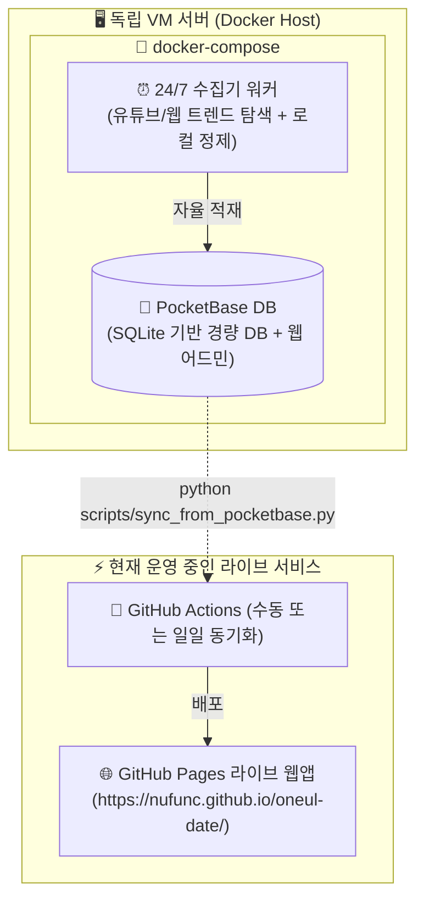

# 🖥️ 외부 VM DB 및 24시간 자율 수집기(Collector) 운영 가이드

> **작성일**: 2026-08-16  
> **상태**: 별도 운영/인프라 가이드 (현재 GitHub Pages 정적 배포와 격리 유지)  
> **관련 소스**: `collector/`, `scripts/sync_from_pocketbase.py`

---

## 📌 1. 개요 및 설계 방향

현재 "오늘 데이트" 서비스는 **GitHub Pages 기반 정적 호스팅(CDN)**으로 초고속 로딩과 서버 비용 0원의 안정성을 확보하고 있습니다.

본 문서는 서비스 운영 중 **스폿 데이터베이스를 24시간 무중단으로 자동 강화**하기 위해, 별도 독립 VM에 도커(Docker) 컨테이너로 **경량 DB(PocketBase)**와 **자율 수집기 워커**를 띄워 운영하는 방법과 향후 연동 절차를 정리합니다.

---

## 🏗️ 2. 전체 아키텍처



---

## 🚀 3. VM 배포 및 실행 방법 (1분 완성)

외부 유료 API 키(Gemini 등) 없이 **100% 로컬 규칙 NLP 엔진**으로 동작하므로, VM에 설정 파일 복사 후 바로 실행할 수 있습니다.

### 1) 파일 준비
VM 서버의 임의 디렉토리(예: `~/oneul-collector`)에 프로젝트 내 `collector/` 폴더 파일들을 복사합니다.

```bash
mkdir -p ~/oneul-collector
cd ~/oneul-collector
```

### 2) 환경 변수 설정 (`.env`)
```bash
cat << 'EOF' > .env
# PocketBase 관리자 계정 설정 (최초 실행 시 자동 생성)
PB_ADMIN_EMAIL=admin@oneul-date.local
PB_ADMIN_PASSWORD=oneul_date_admin_pass_2026!
PB_ENCRYPTION_KEY=oneul_date_secret_key_2026

# 수집 주기 (시간 단위, 기본값: 2시간마다 1회 자율 실행)
COLLECT_INTERVAL_HOURS=2
EOF
```

### 3) 컨테이너 실행
```bash
docker compose up -d --build
```

---

## 📊 4. 관리자 웹 콘솔 & 데이터 검증

* **PocketBase 웹 어드민 URL**: `http://YOUR_VM_IP:8090/_/`
* **기능**:
  * `spots` 컬렉션에서 24시간 동안 자동 수집된 장소들을 테이블/엑셀 형태로 실시간 열람
  * 오분류되거나 부적절한 장소 원클릭 삭제 또는 수정
  * `verified(확인된 장소)` 여부 수동 검수 및 토글

---

## 🔄 5. 프론트엔드 서비스 동기화 방법

현재 GitHub Pages 라이브 서비스에 VM의 최신 수집 데이터를 반영할 때는 아래 동기화 스크립트를 실행합니다:

```bash
# VM의 PocketBase REST API로부터 최신 spots.json 덤프
python scripts/sync_from_pocketbase.py --url http://YOUR_VM_IP:8090

# 빌드 검증 및 배포
npm run build
git add src/data/spots.json
git commit -m "data: VM PocketBase로부터 최신 스폿 동기화"
git push origin dev
```

---

## 🛡️ 6. 장애 격리 및 무중단 원칙

* **VM 다운 시 영향 제로**: VM 서버가 재부팅되거나 네트워크가 끊겨도, 현재 라이브 사이트(GitHub Pages)는 자체 번들된 `spots.json`으로 100% 정상 가동됩니다.
* **비용 0원 유지**: 외부 유료 API나 상용 클라우드 DB 없이 오픈소스 단일 바이너리(PocketBase)와 로컬 파서로만 유지 관리됩니다.
